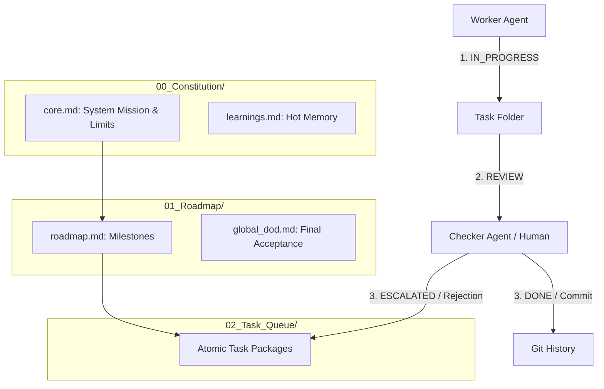

# 🗺️ MAP — C.A.S.E. Framework Global Wiki & Navigation Map

> **Context-Aware Scaffold Engine (C.A.S.E.)** is a universal, file-as-state agent collaboration and audit protocol designed to enforce extreme quality control, prevent context window explosion, and ensure absolute trace transparency in any AI-assisted project.
> 
> **How to use this Map:** This document is the global index map of the C.A.S.E. framework. Both human coordinators and AI agents MUST treat this file as their primary navigation hub. Do NOT read all framework documentation at once (to save token budget). Follow the links below on-demand.

---

## 💎 Key Insights from C.A.S.E. (Macro Perspective)

The C.A.S.E. framework is built upon **eight core pillars** that guarantee quality and scalability:

1. **Three-Layer Architecture (Constitution → Roadmap → Task Queue)**
   - Exposes clear hierarchical authority. The *Constitution* controls global constraints, the *Roadmap* defines milestones, and the *Task Queue* handles execution.
2. **File-as-State (Physical State Machine)**
   - All state, progress, and history are written as visible text files in the filesystem, never hidden inside ephemeral conversation threads. This ensures infinite, lossless session resume capabilities.
3. **Atomic Task Packages**
   - Each task is isolated in a self-contained folder containing everything the agent needs: [role.md](file:///D:/Myproject/Local-Agent-Workspace/C.A.S.E._Framework/02_Task_Queue/Task_003_MECE_Optimization/role.md) (persona), [recipe.md](file:///D:/Myproject/Local-Agent-Workspace/C.A.S.E._Framework/02_Task_Queue/Task_003_MECE_Optimization/recipe.md) (instructions/DoD), `status.txt` (state), and inputs/outputs.
4. **State Machine Flow**
   - Strict status transition constraints: `PENDING` $\rightarrow$ `IN_PROGRESS` $\rightarrow$ `REVIEW` $\rightarrow$ `DONE` (or `ESCALATED` if blocked or self-healing limits are reached).
5. **Worker + Checker Dual-Track Verification**
   - Decoheres the agent's blind spots. The Worker implements the task; the Checker (preferably a separate model/family) independently audits the output against the Recipe's Definition of Done (DoD).
6. **Controlled Tool API**
   - Restricts agents to safe, declarative file reads/writes and status transitions rather than giving raw shell or destructive system access.
7. **Dual Feedback Loops**
   - **Micro-level Loop**: Workers can inject prerequisite subtasks directly into the `02_Task_Queue/` when gaps are found during execution.
   - **Macro-level Loop**: High-level architects adjust the overall Constitution or Roadmap after a milestone completes.
8. **Git-Backed Integrity**
   - The version control system acts as the ultimate truth. Code and artifacts are committed immediately upon Checker approval, and write-defense locks prevent unauthorized edits to read-only directories.

---

## 📂 Wiki Navigation Index

Click the links below to navigate to specific sections of the C.A.S.E. framework:

### 📜 1. Core Scaffolding Directories
* [00_Constitution/](file:///D:/Myproject/Local-Agent-Workspace/C.A.S.E._Framework/00_Constitution/) — Global constraints, mission rules, and memory logs.
  * [core.md](file:///D:/Myproject/Local-Agent-Workspace/C.A.S.E._Framework/00_Constitution/core.md) — The fundamental constraints, language rules, and forbidden actions.
  * [learnings.md](file:///D:/Myproject/Local-Agent-Workspace/C.A.S.E._Framework/00_Constitution/learnings.md) — The active, hot-memory learning diary (strictly limited to 40 lines).
  * [archive_learnings.md](file:///D:/Myproject/Local-Agent-Workspace/C.A.S.E._Framework/00_Constitution/archive_learnings.md) — Cold-memory archival storage for historical learnings.
* [01_Roadmap/](file:///D:/Myproject/Local-Agent-Workspace/C.A.S.E._Framework/01_Roadmap/) — Strategic milestone breakdown.
  * [roadmap.md](file:///D:/Myproject/Local-Agent-Workspace/C.A.S.E._Framework/01_Roadmap/roadmap.md) — Active roadmap of milestones, tasks, and sequence diagrams.
  * [global_dod.md](file:///D:/Myproject/Local-Agent-Workspace/C.A.S.E._Framework/01_Roadmap/global_dod.md) — Global Definition of Done that the entire project must meet to close.
* [02_Task_Queue/](file:///D:/Myproject/Local-Agent-Workspace/C.A.S.E._Framework/02_Task_Queue/) — Active micro-workspace where executor agents perform tasks.

---

### ⚙️ 2. Core Protocol Documents
* [for_agents.md](file:///D:/Myproject/Local-Agent-Workspace/references/for_agents.md) — **System Protocols & Agent Instructions**. Explains how AI agents interact with the status machine, log tools to `action_log.jsonl`, run self-healing scripts, and execute BDD spec-by-example.
* [for_humans.md](file:///D:/Myproject/Local-Agent-Workspace/references/for_humans.md) — **Manual for Humans**. Explains how human operators setup the C.A.S.E. architecture, handle approvals in natural language, and manage Hybrid Cloud-Local (雲地協同) topologies.
* [harness_engineering.md](file:///D:/Myproject/Local-Agent-Workspace/references/harness_engineering.md) — **Harness & Controller Engineering**. Technical specifications for building automated C.A.S.E. runtimes, context compaction sliding windows, tool interceptors, and multi-agent consensus checking.
* [portable_case_harness.md](file:///D:/Myproject/Local-Agent-Workspace/references/portable_case_harness.md) — **Zero-Code Portable Integration (`CASE.md`)**. Guide on how to package and import C.A.S.E. into *any* existing repository using Cursor's `.cursorrules` or Claude Code's system prompts.
* [glossary.md](file:///D:/Myproject/Local-Agent-Workspace/references/glossary.md) — **Glossary of Terms**. Definitions of C.A.S.E. terms (e.g. DoD, Escalated, Hot/Cold Memory, I-Lang, Self-Healing).

---

### 📦 3. Skill & Scripts Layout
* [SKILL.md](file:///D:/Myproject/Local-Agent-Workspace/SKILL.md) — Declarative skill metadata for AI agent harnesses.
* [scripts/](file:///D:/Myproject/Local-Agent-Workspace/scripts/) — Folder containing bootstrap deployment scripts.
  * [bootstrap.py](file:///D:/Myproject/Local-Agent-Workspace/scripts/bootstrap.py) — Cross-platform Python bootstrapper.
  * [bootstrap.ps1](file:///D:/Myproject/Local-Agent-Workspace/scripts/bootstrap.ps1) — Windows PowerShell bootstrapper.
  * [bootstrap.sh](file:///D:/Myproject/Local-Agent-Workspace/scripts/bootstrap.sh) — POSIX shell bootstrapper.
* [templates/](file:///D:/Myproject/Local-Agent-Workspace/templates/) — Folder containing starter templates for recipes, planning, roles, status, and constitutions.
* [verifiers/](file:///D:/Myproject/Local-Agent-Workspace/verifiers/) — Pre-built verification engines to inspect task compliance.
  * [verify.py](file:///D:/Myproject/Local-Agent-Workspace/verifiers/verify.py) — Python task verifier.
  * [verify.js](file:///D:/Myproject/Local-Agent-Workspace/verifiers/verify.js) — Node.js task verifier.
  * [memory_tiering.py](file:///D:/Myproject/Local-Agent-Workspace/verifiers/memory_tiering.py) — Learning diary line limits & archive tiering.

---

## 🛠️ Operating Quick Reference

### For AI Agents (Micro-Task Execution)
1. **Initialize**: Read this `MAP.md` and load [for_agents.md](file:///D:/Myproject/Local-Agent-Workspace/references/for_agents.md) into your system prompt.
2. **Locate task**: Find the folder in `02_Task_Queue/` where `status.txt` is `PENDING`.
3. **Transition**: Set `status.txt` to `IN_PROGRESS` and write your execution plan in `planning.md`.
4. **Develop & Verify**: Run changes, log actions in `action_log.jsonl`, run self-healing tests, and set `status.txt` to `REVIEW`.
5. **Approve**: When approved by Checker or human, transition to `DONE` and perform Git commit.

### For Human Coordinators (Verification & Gating)
* Validate deliverables using [verify.js](file:///D:/Myproject/Local-Agent-Workspace/verifiers/verify.js) via `node verifiers/verify.js 02_Task_Queue/Task_<NNN>`.
* Approve or request changes in natural language. The AI agent will auto-update state files based on your chat feedback.
