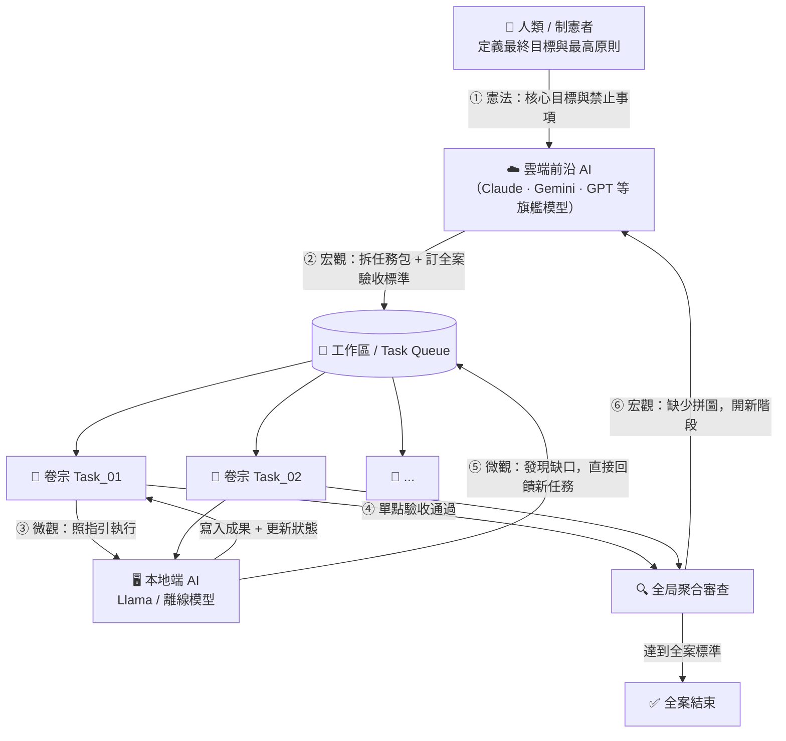

# 📂 C.A.S.E. 框架

## Constitutional Agent State Engine
### 讓 AI 像專業調查團隊一樣，嚴守紀律、有跡可循的協作標準作業架構

> 一個卷宗就是一個任務。一份指引就是一條法律。所有進度，肉眼可見。

---

## 一分鐘看懂架構



---

## 三句話說清楚

| # | 支柱 | 意思 |
|---|------|------|
| 1 | **智力分層** | 聰明的雲端 AI 做大計畫，安全的本地 AI 做苦力 |
| 2 | **萬物皆卷宗** | 所有任務、進度、記憶，都是您電腦裡肉眼可見的真實資料夾與文字檔 |
| 3 | **雙軌核實** | 執行者做完，驗收者審查，Git 版控保底，不怕 AI 發瘋或幻覺 |
| 4 | **雙層回饋** | 本地 AI 執行中發現缺口→直接補任務（微觀）；全局審查未達標→雲端重規劃（宏觀） |

---

## 快速導覽

| 您是誰 | 請前往 |
|--------|--------|
| 👤 **人類（開發者 / 長官 / 協作者）** | [📖 框架理念與設計哲學](docs/for_humans.md) |
| 🤖 **AI Agent（Coding Agent / 自動化工具）** | [⚙️ System Protocols & I/O Rules](docs/for_agents.md) |
| ❓ **名詞看不懂？** | [📚 C.A.S.E. 名詞解釋字典](docs/glossary.md) |

---

## 與 Local-Agent-Workspace 生態系的關係

C.A.S.E. 框架是「為什麼要這樣建構本地 AI」的**哲學基礎**，解釋了生態系三層架構背後的設計邏輯：

```
[ 您的目標 (憲法) ]
        ↓
[ 雲端前沿 AI 規劃 (宏觀層) ]
        ↓
[ Local-Agent-Workspace → Pi Agent → OmniHeal (微觀執行層) ]
```

---

## 設計脈絡（起心動念）

| 文件 | 說明 |
|------|------|
| [📋 會議記錄（精煉版）](docs/context/2026-05-21-meeting-minutes.md) | 八輪討論的重點摘要，可讀性高 |
| [📄 原始對話記錄](docs/context/2026-05-21-雲地混合開發架構理念討論.md) | 完整 Gemini 對話原文（含 UI 噪音） |

回到主專案：[← Local-Agent-Workspace](../README.md)
