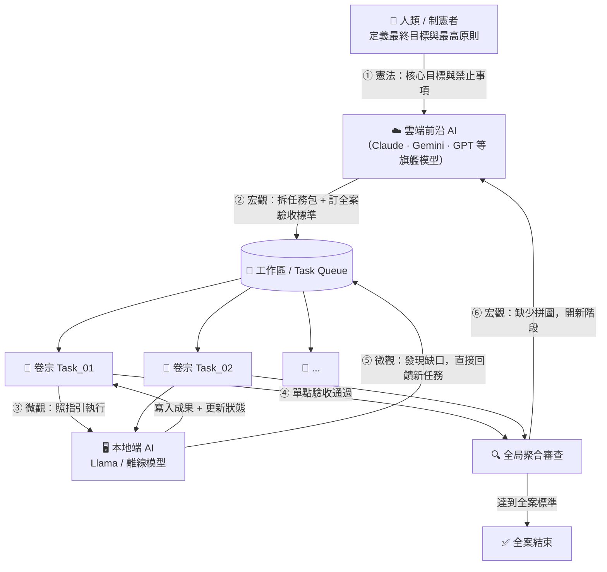

# 📂 C.A.S.E. 框架

## Constitutional Agent State Engine
### 讓 AI 像專業調查團隊一樣，嚴守紀律、有跡可循的協作標準作業架構

> 一個卷宗就是一個任務。一份指引就是一條法律。所有進度，肉眼可見。
> 雲端 AI 負責思考，本地 AI 負責苦勞——讓 Token 花在刀口上。

---

## 一分鐘看懂架構



---

## 💡 C.A.S.E. 的核心理念與痛點解決

### 🤖 面臨的痛點
* **AI 記憶遺忘**：對話歷史過長時，AI 會忘記最初的開發限制或改壞程式碼。
* **雲端 Token 費用昂貴**：跑測試、逐檔除錯、全案掃描等重複性苦力工作，消耗極多雲端 Token。
* **AI 進度謊報**：AI 聲稱任務完成，但實際檔案未寫入，或程式無法運行（AI 幻覺與謊報）。
* **機密資料安全**：敏感程式碼與商業機密直接上傳雲端 API，有隱私洩露風險。

### 🛡️ 解決方案：實體檔案管束 (Physical State Engine)
C.A.S.E. 將大任務拆解成多個獨立的「任務資料夾」，以實體檔案強制規範 AI 的工作路徑：
1. **工作指引 (`recipe.md`)**：規定輸入輸出檔案、驗收 checklist，AI 僅能在限定檔案內讀寫。
2. **角色設定 (`role.md`)**：提供特定的系統 Prompt 載入。
3. **運行控制座 (Harness)**：在執行期監控並壓縮 Context 以節省 VRAM，並在任務完成時檢查 `action_log.jsonl`，確保 AI 確實執行了儲存與測試指令，不准說謊。

---

## 💎 C.A.S.E. 為您的專案帶來什麼好處？

* **💰 狂省 90% 費用**：把最花 Token 的苦力活（代碼編修、單元測試、程式碼健檢）交給**本地端免費**的 AI 跑。
* **🔒 商業資料絕對安全**：程式碼與機密資料全程留在您本機中，物理隔離不下海。
* **🧠 跨平台「永久記憶」**：所有進度都在實體檔案（status.txt）中，即便 AI 斷線、或中途換別的 AI 軟體，讀了檔案就能立刻接下去做。
* **🛡️ 拒絕 AI 裝忙說謊**：Harness 自動翻閱實體日誌，若發現 AI 沒寫入檔案、沒跑過測試就謊報成功，會直接退件並還原代碼。

---

## 🚀 3 分鐘快速上手（讓您的 AI 專案秒變專業 Repo！）

本專案已經為 AI 智能體編寫好了完整的 **`for_agents.md`** 規則文件。您**不需要**手動複製或建立任何資料夾！只需在您要開發的任何專案根目錄下，開啟終端機並複製貼上以下其中一行指令即可：

### 1️⃣ 第一步：一鍵下載規則文件
* **💻 Linux / macOS / Git Bash (cURL)**:
  ```bash
  curl -fsSL https://raw.githubusercontent.com/Chiakai-Chang/Local-Agent-Workspace/main/C.A.S.E._Framework/docs/for_agents.md -o CASE_framework_for_agents.md
  ```
* **💻 Windows (PowerShell)**:
  ```powershell
  Invoke-WebRequest -Uri "https://raw.githubusercontent.com/Chiakai-Chang/Local-Agent-Workspace/main/C.A.S.E._Framework/docs/for_agents.md" -OutFile "CASE_framework_for_agents.md"
  ```
> 💡 *說明：本指令僅會下載一個唯讀的 `.md` 文件，完全無任何代碼執行，絕無安全疑慮，且不會覆蓋您專案中的任何既有檔案。*

### 2️⃣ 第二步：給您的 AI 智能體貼上引導 Prompt
啟動您的 IDE AI 輔助軟體（Cursor、Claude Code、Windsurf 等），將下載好的 `CASE_framework_for_agents.md` 文件作為參考（例如在 Cursor 中使用 `@`），並輸入以下 Prompt：
> 「請閱讀我專案中的 [CASE_framework_for_agents.md](CASE_framework_for_agents.md) 文件。閱讀後，請分析我目前的專案結構，規劃如何以最合適的方式為本專案建立 C.A.S.E 物理目錄結構（包含 Constitution、Roadmap、Task_Queue 任務資料夾），並將此執行期規則妥善整合寫入您的長效記憶配置中（例如 `CLAUDE.md`、`.cursorrules`、`gemini.md` 或 `memory.md` 等對應位置）。在建立目錄與寫入配置前，請先向我報告您的規劃並取得我的同意。」

### 3️⃣ 第三步：檢閱並同意 AI 的自動配置
AI 智能體在讀取 Prompt 後，會自動分析您的專案、自動規劃並為您創立所有物理目錄、並妥善配置好 IDE 的原生規則。您只需輸入 `Yes` 或確認同意，AI 就會自己幫您全部設定妥當！

---

## 四大支柱

| # | 支柱 | 意思 |
|---|------|------|
| 1 | **智力分層** | 聰明的雲端 AI 做大計畫，安全的本地 AI 做苦力 |
| 2 | **萬物皆卷宗** | 所有任務、進度、記憶，都是您電腦裡肉眼可見的真實資料夾與文字檔 |
| 3 | **雙軌核實** | 執行者做完，驗收者審查，Git 版控保底，不怕 AI 發瘋或幻覺 |
| 4 | **雙層回饋** | 本地 AI 執行中發現缺口→直接補任務（微觀）；全局審查未達標→雲端重規劃（宏觀） |

---

## 快速導覽

| 您是誰 | 請前往 |
|--------|--------|
| 👤 **人類（開發者 / 長官 / 協作者）** | [📖 框架理念與設計哲學](docs/for_humans.md) |
| 🤖 **AI Agent（Coding Agent / 自動化工具）** | [⚙️ System Protocols & I/O Rules](docs/for_agents.md) |
| 🛡️ **系統開發者 / 協調器設計師** | [⚙️ Harness Engineering 規範與優化設計](docs/harness_engineering.md) |
| 📦 **一般 AI 專案使用者 / 快速套件** | [⚙️ Portable C.A.S.E. 攜帶式套件與自動化設計](docs/portable_case_harness.md) |
| ❓ **名詞看不懂？** | [📚 C.A.S.E. 名詞解釋字典](docs/glossary.md) |

---

## 與 Local-Agent-Workspace 生態系的關係

C.A.S.E. 框架是「為什麼要這樣建構本地 AI」的**哲學基礎**，解釋了生態系三層架構背後的設計邏輯：

```
[ 您的目標 (憲法) ]
        ↓
[ 雲端前沿 AI 規劃 (宏觀層) ]
        ↓
[ Local-Agent-Workspace → Pi Agent → OmniHeal (微觀執行層) ]
```

---

## 設計脈絡（起心動念）

| 文件 | 說明 |
|------|------|
| [📋 會議記錄（精煉版）](docs/context/2026-05-21-meeting-minutes.md) | 八輪討論的重點摘要，可讀性高 |
| [📄 原始對話記錄](docs/context/2026-05-21-雲地混合開發架構理念討論.md) | 完整 Gemini 對話原文（含 UI 噪音） |

回到主專案：[← Local-Agent-Workspace](../README.md)
