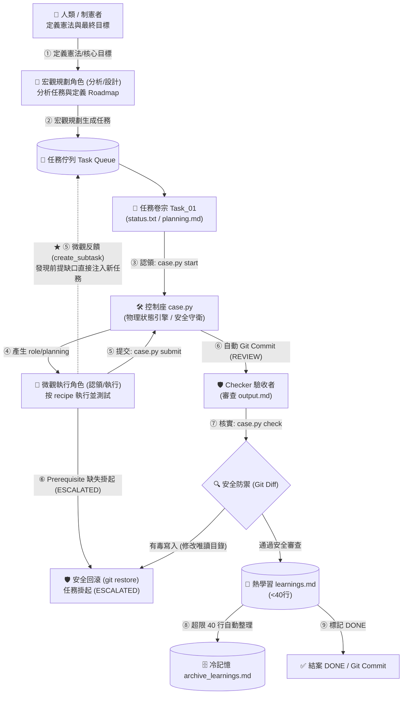

# 📂 C.A.S.E. 框架

## Constitutional Agent State Engine
### 讓 AI 像專業調查團隊一樣，嚴守紀律、有跡可循的協作標準作業架構

> 一個卷宗就是一個任務。一份指引就是一條法律。所有進度，肉眼可見。
> 角色職責解耦分工——讓 Token 花在刀口上。

---

## 一分鐘看懂架構 (C.A.S.E. 2.0)



---

## 💡 C.A.S.E. 的核心理念與痛點解決

### 🤖 面臨的痛點
* **AI 記憶遺忘**：對話歷史過長時，AI 會忘記最初的開發限制或改壞程式碼。
* **Token 費用昂貴**：讓旗艦雲端模型重複進行程式碼掃描、跑測試、改小 Bug 等，消耗大筆 Token 與費用。
* **AI 進度謊報**：AI 聲稱任務完成，但實際檔案未寫入，或程式無法運行（AI 幻覺與謊報）。
* **安全與隱私風險**：敏感代碼、資料庫密鑰或專案機密直接上傳雲端 API，有洩露隱私之虞。

### 🛡️ 解決方案：實體檔案管束 (Physical State Engine)
C.A.S.E. 將大任務拆解成多個獨立的「任務資料夾」，以實體檔案強制規範 AI 的工作路徑：
1. **工作指引 (`recipe.md`)**：規定輸入輸出檔案、驗收 checklist，AI 僅能在限定檔案內讀寫。
2. **角色設定 (`role.md`)**：提供特定的系統 Prompt 載入。
3. **微觀復盤與版控**：認領任務後先作細部規劃（如 `planning.md`），隨後謹慎執行， Checker 驗收後由 Harness 自動進行 git commit & push。
4. **運行控制座 (Harness)**：在執行期監控並壓縮 Context 以節省 VRAM/Token。在任務完成時檢查 `action_log.jsonl`，確保 AI 確實執行了儲存與測試指令，不准說謊。

---

## 🌟 C.A.S.E. 2.0 重大架構演進與技術理念

為了解決實務開發中的邊界安全、Context 爆滿以及不同推理能力模型（如較小參數規模模型）的適應性，框架近期引入了以下核心優化：

### 1. 🧠 冷熱學習記憶分層 (Memory Tiering - SkillOpt)
* **痛點**：AI 的反思學習日記 (`learnings.md`) 會隨著開發愈寫愈長，導致後續任務的 Context Window 爆滿、Token 成本飆升。
* **解法**：實施冷熱分層。熱記憶 (`learnings.md`) 限制在 **40 行（約 15 條記錄）**以內以保持敏捷；超出部分由控制腳本在結案時自動封存至冷記憶庫 (`archive_learnings.md`) 中。

### 2. 🛡️ 防毒害與防寫安全防線 (Git-Backed Write Defense)
* **痛點**：純文字引導無法真正阻止 AI 發瘋或受到外部代碼 Prompt Injection 攻擊，惡意篡改憲法 (`00_Constitution/`) 或 Roadmap。
* **解法**：引入 Git 保底機制。當執行 `case.py check` 核實任務時，腳本會自動檢測唯讀目錄。若發現被 Worker 篡改，會**自動觸發安全回滾 (`git restore`)**，將任務設為 `ESCALATED` 阻斷毒害擴散。

### 3. 📉 弱推理模型降級適應 (Weak Model Adaptation)
* **痛點**：部分推理能力較弱的模型（如輕量化開源模型）對高密度的 I-Lang 壓縮語法（如 `[T]`, `[A]`, `[V]`）和箭頭運算子理解力不足，易卡在格式錯誤死循環中。
* **解法**：放寬為**軟性降級規則**。弱模型若理解困難，可自動 fallback 使用結構化自然語言編寫 `planning.md`，在大模型與弱模型間取得最佳性價比。

### 4. 🎛️ 零依賴微型控制座 (case.py CLI)
* **痛點**：市面上的 Agent Harness 系統需要複雜的依賴與軟體安裝，學習與維護成本高。
* **解法**：提供單一、不到 300 行的 Python 腳本 `.case/case.py`，免除任何第三方庫。以最簡的指令（`start`、`submit`、`check`）自動化狀態切換、安全審計與自動 Git 存檔，完美貼合**「外掛式、不破壞原始碼」**的哲學。

---

## 💎 C.A.S.E. 為您的專案帶來什麼好處？

* **🌐 靈活部署，兼容全場景**：完美兼容全雲端（Cloud VM）、全本地（離線開發）與雲地混合架構，任何模型皆可隨時接入。
* **💰 靈活成本配比**：將高耗能的苦力活（代碼編修、單元測試）分流至本地端免費或雲端輕量模型，最大化性價比。
* **🔒 安全與沙箱隔離**：程式碼可留在本機或在虛擬沙箱（如透過 `trycua` 工具）中執行，與敏感環境物理隔離。
* **🧠 跨平台「永久記憶」**：所有進度都在實體檔案（status.txt）中，即便 AI 斷線、或中途換別的 AI 軟體，讀了檔案就能立刻接下去做。
* **🛡️ 拒絕 AI 裝忙說謊**：Harness 自動翻閱實體日誌，若發現 AI 沒寫入檔案、沒跑過測試就謊報成功，會直接退件並還原代碼。

---

## 🚀 3 分鐘快速上手（將 C.A.S.E 規範一鍵植入任何 AI 專案）

> 🔒 **隨插即用，安全無痛 (Non-Destructive Outer-Harness)**
> C.A.S.E 採用外掛式架構。**不論是全新的專案，還是已經有大量代碼的現有舊專案，皆可隨時、無痛導入**。它只會在專案根目錄外掛獨立的管理資料夾，**絕對不會搬移或破壞您現有的原始碼目錄結構**。

---

### 💡 推薦：方式 A（一鍵 CLI 自動引導，最省心）
直接在您想導入的專案根目錄下，開啟終端機執行以下一行指令。這會自動下載輕量控制腳本並引導初始化：
*   **💻 Windows (PowerShell)**:
    ```powershell
    mkdir -p .case; Invoke-WebRequest -Uri "https://raw.githubusercontent.com/Chiakai-Chang/Local-Agent-Workspace/main/C.A.S.E._Framework/.case/case.py" -OutFile ".case/case.py"; python .case/case.py init
    ```
*   **💻 Linux / macOS / Git Bash**:
    ```bash
    mkdir -p .case && curl -fsSL https://raw.githubusercontent.com/Chiakai-Chang/Local-Agent-Workspace/main/C.A.S.E._Framework/.case/case.py -o .case/case.py && python3 .case/case.py init
    ```
> 💡 *說明：本指令會自動在專案中建立 `.case/case.py`，建立物理目錄，並在您的 `.cursorrules` 中寫入 C.A.S.E 規則，完全免除手動配置負擔。*

### 🛡️ 方式 B（免執行代碼，純 AI 自動配置）
如果您所在的伺服器有嚴格的安全限制，不想在終端機執行任何外來 Python 腳本：

<details>
<summary><b>💬 展開純 AI 引導步驟</b></summary>

1. **一鍵下載 C.A.S.E. Agent 規則手冊 (CASE_framework_for_agents.md)**：
   * **💻 Linux / macOS**:
     ```bash
     curl -fsSL https://raw.githubusercontent.com/Chiakai-Chang/Local-Agent-Workspace/main/C.A.S.E._Framework/docs/for_agents.md -o CASE_framework_for_agents.md
     ```
   * **💻 Windows (PowerShell)**:
     ```powershell
     Invoke-WebRequest -Uri "https://raw.githubusercontent.com/Chiakai-Chang/Local-Agent-Workspace/main/C.A.S.E._Framework/docs/for_agents.md" -OutFile "CASE_framework_for_agents.md"
     ```
2. **給您的 AI Agent 貼上極簡引導 Prompt**：
   > `請閱讀專案中的 CASE_framework_for_agents.md，並依此初始化本專案的 C.A.S.E 架構。`
3. **確認 AI 的配置**：
   AI Agent 將會自己動手完成目錄建立與長效記憶注入。
</details>

---

### 🛠️ 任務生命週期管理指令

初始化完成後，不論是您還是 AI Agent，都能使用 `.case/case.py` 旗下的指令，以極簡的交互來推動任務進度：
*   **認領並開始任務**：`python .case/case.py start <task_id>`（自動將狀態改為執行中，並產生 `planning.md` 規劃模板）。
*   **完成並提交審核**：`python .case/case.py submit <task_id> "<summary>"`（自動改為審核中，並產生 Git commit）。
*   **Checker 審查與冷熱記憶維護**：`python .case/case.py check <task_id>`（Checker 自動執行：比對唯讀目錄防篡改、DoD 規範檢查、Hot/Cold 學習日誌超載轉移，通過後自動結案並 Git 存檔）。

---

## 四大支柱

| # | 支柱 | 意思 |
|---|------|------|
| 1 | **角色分層** | 宏觀規劃層做大計畫與任務拆分，微觀執行層專注按步執行（可用同一模型或不同模型） |
| 2 | **萬物皆卷宗** | 所有任務、進度、記憶，都是您電腦裡肉眼可見的真實資料夾與文字檔 |
| 3 | **雙軌核實** | 執行者做完，驗收者審查，Git 版控保底，不怕 AI 發瘋或幻覺 |
| 4 | **雙層回饋** | 執行中發現前置缺口→直接補任務（微觀）；全局審查未達標→重新規劃調整（宏觀） |

---

## 快速導覽

| 您是誰 | 請前往 |
|--------|--------|
| 👤 **人類（開發者 / 長官 / 協作者）** | [📖 框架理念與設計哲學](docs/for_humans.md) |
| 🤖 **AI Agent（Coding Agent / 自動化工具）** | [⚙️ System Protocols & I/O Rules](docs/for_agents.md) |
| 🛡️ **系統開發者 / 協調器設計師** | [⚙️ Harness Engineering 規範與優化設計](docs/harness_engineering.md) |
| 📦 **一般 AI 專案使用者 / 快速套件** | [⚙️ Portable C.A.S.E. 攜帶式套件與自動化設計](docs/portable_case_harness.md) |
| ❓ **名詞看不懂？** | [📚 C.A.S.E. 名詞解釋字典](docs/glossary.md) |

---

## 與 Local-Agent-Workspace 生態系的關係

C.A.S.E. 框架是「為什麼要這樣建構本地 AI」的**哲學基礎**，解釋了生態系三層架構背後的設計邏輯：

```
[ 您的目標 (憲法) ]
        ↓
[ 宏觀規劃角色 (Strategic Planner) ]
        ↓
[ 微觀執行與驗收 (Tactical Executor & Checker) ]
```

*(註：本架構不限定任何模型參數大小或部署拓撲。這兩層角色可以完全由本機同一個模型（例如本機單一 27B/32B 模型）跑完全流程；亦能透過「雲地混合」由雲端大模型規劃宏觀 Roadmap，再由本地端模型（如 Local-Agent-Workspace + Pi Agent + OmniHeal 生態系）專注於微觀執行與安全驗收，在資料隱私與性價比之間取得最佳平衡。)*

---

## 🙏 參考先驅與開源致敬 (Prior Art & Acknowledgements)

> **💡 開發歷程與觀念驗證說明：**
> 本專案的 **C.A.S.E. 框架** 與 **Harness 控制座** 設計理念，最初源於本地開發 AI Agent 的實戰過程，是在解決 AI 容易遺忘指令、幻覺謊報進度、重複除錯陷入「鬼打牆」，以及最讓開發者痛切的雲端 API「Quota (額度) 與 Token 費用焦慮」等實務痛點時，**獨立摸索、設計並成功實踐出來的成果**。
>
> 隨後，在瀏覽技術社群時，驚喜地發現 **IBM Developer Advocate Tejas Kumar** 於 **AI Engineer Europe 2026** 發表之經典專題演講中，也提出了極為相似的 Harness 控制座思維！這極大地驗證了本地實踐方向的正確性。因此，後續迅速參考並整合了 IBM 的大廠工程規範，將其精髓納入本專案的文檔中。在此向同樣獨立推動此工程觀念的先驅者致以最誠摯的敬意：

* **📺 經典演講影片**：[Harnesses in AI: A Deep Dive — Tejas Kumar, IBM (YouTube)](https://youtu.be/C_GG5g38vLU?si=NVt8LgZaIRPOO6-Z)
* **💻 官方開源示範**：[TejasQ/basically-ai-harness (GitHub)](https://github.com/TejasQ/basically-ai-harness)
* **🐦 講者社群連結**：[@TejasKumar_ (X/Twitter)](https://x.com/TejasKumar_) | [@TejasQ (GitHub)](https://github.com/TejasQ)

強烈推薦所有使用本生態系的開發者觀看該演講，這將能讓您雙重印證「不該過度依賴寫死 Prompt，而應透過 Harness 外部程式碼與規則來管束黑盒子模型」的控制座工程核心思維。

---

## 設計脈絡（起心動念）

| 文件 | 說明 |
|------|------|
| [📋 會議記錄（精煉版）](docs/context/2026-05-21-meeting-minutes.md) | 八輪討論的重點摘要，可讀性高 |
| [📄 原始對話記錄](docs/context/2026-05-21-雲地混合開發架構理念討論.md) | 完整 Gemini 對話原文（含 UI 噪音） |

回到主專案：[← Local-Agent-Workspace](../README.md)
