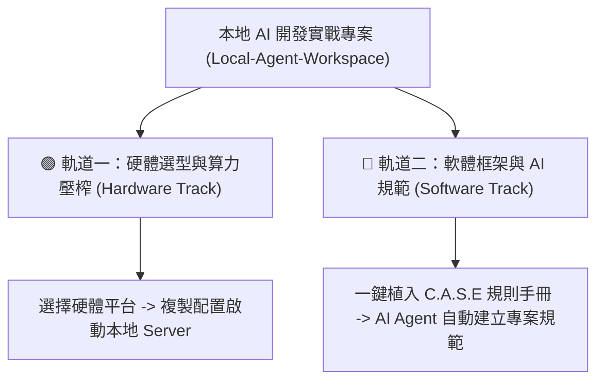
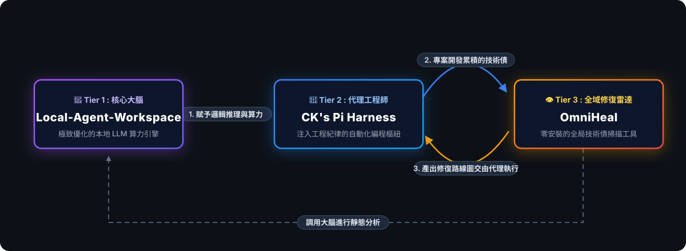

# 🚀 Local-Agent-Workspace

> [!IMPORTANT]
> **個人立場聲明：** 本專案僅為個人技術研究分享，所有內容與參數調校均基於公開開源數據。專案內容不代表任何機關立場，亦不涉及任何公務機敏資料。

### 本地 AI 極致壓榨與開發規範雙軌指南 (Hardware & Software Dual-Track Guide)

本專案提供兩大獨立且可平行參考的本地 AI 實戰維度：



---

## 🟢 軌道一：硬體選型與本機算力極致壓榨 (Hardware Track)

為防範不同硬體平台的使用者因 VRAM 限制遭遇崩潰，我們提供以下最佳化的啟動腳本範本。您可以直接複製對應的配置，建立您的本機 `.bat` 啟動檔：

### 📊 本地算力平台快速選取看板
| 硬體環境 (Hardware Platform) | 核心推薦模型 (Recommended Model) | 檔案大小 (Size) | 推理效能 (Inference Performance) | 啟動設定說明 (Setup Link) |
| :--- | :--- | :--- | :--- | :--- |
| **高階顯卡 (20GB+ VRAM)** | GRM-2.6-Opus 27B / Qwopus 27B | 15.3G / 15.4G | MTP 投機解碼 (~49 T/s) | [▶️ 檢視配置](#1-grm-opus--qwopus-mtp-20gb-vram-) |
| **中階顯卡 (16GB VRAM)** | Qwen3.6-35B-A3B-Cerebellum | **12 GB** | **GPU 全卸載** MoE 線性推理 | [▶️ 檢視配置](#2-qwen36-cerebellum-gpu--16gb-vram-) |
| **純 CPU / 大 RAM (32GB+)** | Qwen3.6-35B-A3B-Cerebellum | **12 GB** | MoE+SSM **純 CPU** 線性推理 | [▶️ 檢視配置](#3-cpu-moessm--32gb-ram-) |

> [!IMPORTANT]
> **⚠️ 必做步驟：建立本機啟動檔時請務必修改路徑！**
> 下列腳本範本中，`LLAMA_EXE` 與 `MODEL` 預設為開發環境路徑（如 `D:\MyProject\...`）。**在您首次執行前，請務必將這兩個變數修改為您本機的實際路徑！**
> * 💡 為了防範閃退，腳本中已內建了 **「路徑自動校驗機制」**，若路徑未修改或檔案不存在，啟動時將會在 Console 顯示錯誤警告並自動暫停（Pause），便於您排查！

---

### 1. 🟢 高階顯卡 MTP 極速版 (20GB+ VRAM 專屬)
* **核心優勢**：適合 RTX A4500 等 20GB+ 高階顯卡。透過 `llama.cpp` 內建預測頭（MTP）實現 **5 倍推理速度提升**，配合 4-bit KV Cache 壓縮技術，實現 **128K** 超大 Context 且完全不溢位（OOM）。
* **適合模型**：首選 `GRM-2.6-Opus-Heretic-Abliterated-MTP-IQ4_XS` (15.3 GB) 或 `Qwopus3.6-27B-v2-MTP-IQ4_XS` (15.4 GB)。

##### ⚡ NVIDIA MTP 效能調校精華 (Tuning Essence)：
* **MTP 自我投機解碼 (`--spec-type draft-mtp`)**：免掛載外部小模型，推理速度狂飆 4x-5x（達 49 T/s）。
* **4-bit KV 快取壓縮 (`-ctk q4_0 -ctv q4_0`)**：壓縮 KV Cache，節省 72% VRAM，大上下文不溢位。
* **P-cores 綁定 (`--threads 8`)**：鎖定 8 顆實體 Performance Cores 以獲取最低延遲。

<details>
<summary><b>📂 點此複製 BAT 啟動腳本 (NVIDIA MTP 旗艦版)</b></summary>

```batch
@echo off
setlocal
title NVIDIA MTP Server [RTX A4500 20GB+ Max Performance]

:: !!!!!!!!!!!!!!!!!!!!!!!!!!!!!!!!!!!!!!!!!!!!!!!!!!!!!!!!!!!!!!!!!!!!
:: !!! CRITICAL: YOU MUST UPDATE THE PATHS BELOW TO REFLECT YOUR     !!!
:: !!! LOCAL ENVIRONMENT BEFORE RUNNING THIS SCRIPT.                 !!!
:: !!!!!!!!!!!!!!!!!!!!!!!!!!!!!!!!!!!!!!!!!!!!!!!!!!!!!!!!!!!!!!!!!!!!
:: ====================================================================
:: [Configuration Paths] Please modify the paths below to match your system.
:: ====================================================================
set LLAMA_EXE=D:\MyProject\llama\llama-server.exe
set PORT=8080
set CTX_SIZE=131072

:: --------------------------------------------------------------------
:: [Model Selection] Uncomment the one you want to run.
:: --------------------------------------------------------------------
:: Option A: GRM-2.6-Opus-Heretic-Abliterated-MTP-IQ4_XS (15.3 GB) - DEFAULT
set MODEL=D:\MyProject\llama\GRM-2.6-Opus-Heretic-Abliterated-MTP-IQ4_XS.gguf

:: Option B: Qwopus3.6-27B-v2-MTP-IQ4_XS (15.4 GB)
:: set MODEL=D:\MyProject\llama\Qwopus3.6-27B-v2-MTP-GGUF.gguf

:: Verify paths exist before executing to prevent silent crashes
if not exist "%LLAMA_EXE%" (
    echo ========================================================
    echo [CRITICAL ERROR] llama-server.exe was not found at:
    echo "%LLAMA_EXE%"
    echo.
    echo Please open this .bat file in a text editor and update
    echo the LLAMA_EXE path variable to point to your actual executable!
    echo ========================================================
    pause
    exit /b
)

if not exist "%MODEL%" (
    echo ========================================================
    echo [CRITICAL ERROR] GGUF Model file was not found at:
    echo "%MODEL%"
    echo.
    echo Please open this .bat file in a text editor and update
    echo the MODEL path variable to point to your actual .gguf file!
    echo ========================================================
    pause
    exit /b
)

"%LLAMA_EXE%" ^
  -m "%MODEL%" ^
  -ngl 999 ^
  -c %CTX_SIZE% ^
  --host 127.0.0.1 ^
  --port %PORT% ^
  -np 1 ^
  -b 512 ^
  -ub 128 ^
  --spec-type draft-mtp ^
  --spec-draft-n-max 3 ^
  --spec-draft-ngl all ^
  --cache-type-k q4_0 ^
  --cache-type-v q4_0 ^
  --cache-type-kd q4_0 ^
  --cache-type-vd q4_0 ^
  --kv-unified ^
  --cache-ram 12288 ^
  --cache-idle-slots ^
  --flash-attn on ^
  --mmap ^
  --no-warmup ^
  --jinja ^
  --threads 8 ^
  --threads-batch 12 ^
  --prio 2 ^
  --reasoning-format deepseek ^
  --timeout 1200

pause
```
</details>

<details>
<summary><b>📖 展開檢視 NVIDIA 參數深度解析</b></summary>

* **`--spec-type draft-mtp` & `--spec-draft-ngl all`**：自動載入 GGUF 內建預測頭，並將 base model 與 draft heads 全數塞入 VRAM 進行 GPU 滿載加速。
* **`-ctk q4_0 -ctv q4_0` 與 `-ctkd q4_0 -ctvd q4_0`**：將 KV Cache 進行 4-bit 量化壓縮，節省 72% VRAM！在 128K Context 時 KV 快取僅佔 ~200MB，徹底防範 VRAM 溢出。
* **`--kv-unified`**：令主模型與預測頭共享 KV Buffer 快取以節省記憶體。
* **`--cache-ram 12288`**：劃分 12GB 實體 RAM 快取對話上下文。多輪對話時，歷史脈絡直接載入，**跳過 prompt re-eval 進程，解鎖 sub-second 首字輸出速度**。
* **`--threads 8`**：將計算線程強制鎖定在 Intel i7 的 **8 顆 P-cores 實體效能核心**上，防範系統將線程派發給 E-cores 或超線程中而拉高延遲。
* **`--reasoning-format deepseek`**：自動提取模型推理時產生的 `<think>` 思考流，完美對接 Open WebUI 等折疊式思維泡泡 UI。
</details>

---

### 2. 🟡 中階顯卡 GPU 極速版 (16GB VRAM 專屬)
* **核心優勢**：**16GB VRAM 扣除 Windows 系統與顯卡 WDDM 佔用後實際僅剩約 14GB VRAM**。在此物理限制下，若強行載入 15.4GB 的 27B 模型，會導致大批層數溢出至系統 RAM，因 PCIe 頻寬瓶頸而速度暴跌！
* **極佳解法**：強烈推薦選用僅 **12 GB** 大小、採用敏感度引導混合壓縮的 `Qwen3.6-35B-A3B-Cerebellum`。這能將模型**全數載入 16GB VRAM**，並保留充足的 **2.5GB 運算空間**，完美在顯卡內執行 Flash-Attention、量化 KV Cache 與多模態視覺投影，享受流暢無PCIe 交換的極致運算！

##### ⚡ NVIDIA GPU 卸載效能調校精華 (Tuning Essence)：
* **GPU 完全卸載 (`-ngl 999`)**：確保 100% 的模型張量全數塞在 VRAM 中運行。
* **4-bit KV 快取壓縮 (`-ctk q4_0 -ctv q4_0`)**：壓縮 KV 快取，預留大上下文空間。
* **物理線程綁定 (`--threads 8`)**：由實體效能核心協同高頻調度。

<details>
<summary><b>📂 點此複製 BAT 啟動腳本 (Cerebellum GPU 全卸載版)</b></summary>

```batch
@echo off
setlocal
title Qwen3.6-35B-A3B-Cerebellum [NVIDIA GPU Offload - 16GB VRAM]

:: !!!!!!!!!!!!!!!!!!!!!!!!!!!!!!!!!!!!!!!!!!!!!!!!!!!!!!!!!!!!!!!!!!!!
:: !!! CRITICAL: YOU MUST UPDATE THE PATHS BELOW TO REFLECT YOUR     !!!
:: !!! LOCAL ENVIRONMENT BEFORE RUNNING THIS SCRIPT.                 !!!
:: !!!!!!!!!!!!!!!!!!!!!!!!!!!!!!!!!!!!!!!!!!!!!!!!!!!!!!!!!!!!!!!!!!!!
:: ====================================================================
:: [Configuration Paths] Please modify the paths below to match your system.
:: ====================================================================
set LLAMA_EXE=D:\MyProject\llama\llama-server.exe
set MODEL=D:\MyProject\llama\Qwen3.6-35B-A3B-Cerebellum.gguf
set CTX_SIZE=32768
set PORT=8080

:: Verify paths exist before executing to prevent silent crashes
if not exist "%LLAMA_EXE%" (
    echo ========================================================
    echo [CRITICAL ERROR] llama-server.exe was not found at:
    echo "%LLAMA_EXE%"
    echo.
    echo Please open this .bat file in a text editor and update
    echo the LLAMA_EXE path variable to point to your actual executable!
    echo ========================================================
    pause
    exit /b
)

if not exist "%MODEL%" (
    echo ========================================================
    echo [CRITICAL ERROR] GGUF Model file was not found at:
    echo "%MODEL%"
    echo.
    echo Please open this .bat file in a text editor and update
    echo the MODEL path variable to point to your actual .gguf file!
    echo ========================================================
    pause
    exit /b
)

"%LLAMA_EXE%" ^
  -m "%MODEL%" ^
  -ngl 999 ^
  -c %CTX_SIZE% ^
  --host 127.0.0.1 ^
  --port %PORT% ^
  -np 1 ^
  -b 512 ^
  -ub 128 ^
  --cache-type-k q4_0 ^
  --cache-type-v q4_0 ^
  --flash-attn on ^
  --mmap ^
  --no-warmup ^
  --jinja ^
  --threads 8 ^
  --threads-batch 12 ^
  --prio 2 ^
  --timeout 1200

pause
```
</details>

---

### 3. 🔵 純 CPU 與大記憶體優化版 (無 GPU / 大 RAM 主機)
* **核心優勢**：**系統記憶體 (RAM) 容量充足為最大優勢**（16GB RAM 可開 32K，32GB 可開滿 128K！）。**此平台必須關閉 MTP（投機解碼在 CPU 上會拖慢速度）**，且 prefill（提示詞預評估）速度會較為緩慢，但對話解碼速率穩定。
* **適合模型**：首選 `Qwen3.6-35B-A3B-Cerebellum` (12 GB MoE 混合模型，推理時活化參數僅約 3B)，備用單體 `Qwopus3.6-7B-IQ4_XS`。

##### 🛠️ CPU 效能調校精華 (Tuning Essence)：
* **關閉 GPU (`-ngl 0`)**：強制算力全部保留在實體 CPU 與系統記憶體中。
* **鎖定 P-cores 實體效能核心 (`--threads 8`)**：避免背景任務被分發至 E-cores，大幅降低解碼延遲。
* **記憶體 vs Prefill 速度權衡**：32GB RAM 開 128K context 不會 OOM，但 CPU 頻寬低，Prefill 首字延遲 (TTFT) 會很長。

<details>
<summary><b>📂 點此複製 BAT 啟動腳本 (CPU Optimized)</b></summary>

```batch
@echo off
setlocal
title Llama.cpp CPU Server [Unified CPU Performance Tuning]

:: !!!!!!!!!!!!!!!!!!!!!!!!!!!!!!!!!!!!!!!!!!!!!!!!!!!!!!!!!!!!!!!!!!!!
:: !!! CRITICAL: YOU MUST UPDATE THE PATHS BELOW TO REFLECT YOUR     !!!
:: !!! LOCAL ENVIRONMENT BEFORE RUNNING THIS SCRIPT.                 !!!
:: !!!!!!!!!!!!!!!!!!!!!!!!!!!!!!!!!!!!!!!!!!!!!!!!!!!!!!!!!!!!!!!!!!!!
:: ====================================================================
:: [Configuration Paths] Please modify the paths below to match your system.
:: ====================================================================
set LLAMA_EXE=D:\MyProject\llama\llama-server.exe
set PORT=8080
set CTX_SIZE=16384

:: --------------------------------------------------------------------
:: [Model Selection] Uncomment the one you want to run.
:: --------------------------------------------------------------------
:: Option A: Extreme MoE Player Choice (Qwen3.6-35B-A3B-Cerebellum 12GB GGUF) - RECOMMENDED
set MODEL=D:\MyProject\llama\Qwen3.6-35B-A3B-Cerebellum.gguf

:: Option B: High-Precision 7B CPU Baseline (Recommended IQ4_XS for balanced speed/quality)
:: set MODEL=D:\MyProject\llama\Qwopus3.6-7B-IQ4_XS.gguf

echo ========================================================
echo Starting Pure CPU LLM Server...
echo Model  : %MODEL%
echo Host   : http://127.0.0.1:%PORT%
echo Context: %CTX_SIZE% (16K optimized for CPU)
echo GPU    : Disabled (ngl 0)
echo Threads: P-core direct binding [8 Physical Cores]
echo ========================================================

:: Parameters Explained:
:: 1. ngl 0: Disables GPU offloading completely, forcing running on host CPU.
:: 2. c 16384: Default context size is 16K (optimized for general CPU speed).
::    Note: Huge physical RAM capacity is the core advantage of running on CPU.
::    - 16GB RAM: Easily scale context size (-c) up to 32K.
::    - 32GB RAM: Run high-precision quant (like IQ4_XS) and scale context size (-c) to 128K (131072) without OOM.
::    - 64GB+ RAM: Run larger models (27B/72B) with 128K+ context sizes fully unhindered.
::    However, since CPU memory bandwidth is lower than GPU, prefill speed (TTFT) scales slowly.
::    If you accept slower prefill times, feel free to adjust CTX_SIZE above to 131072 to unlock maximum capacity.
:: 3. threads 8: Binds thread pool directly to P-cores to prevent scheduling onto E-cores or hyperthreads.
:: 4. prio 2: High Priority in Windows to prevent background OS interrupts.
:: 5. Note on MTP (Speculative Decoding) on CPU: While llama.cpp supports MTP on CPU, testing shows
::    that enabling MTP does NOT speed up CPU inference. The draft head evaluation overhead and memory
::    bandwidth contention actually slow down decoding. Thus, MTP parameters are omitted here.

:: Verify paths exist before executing to prevent silent crashes
if not exist "%LLAMA_EXE%" (
    echo ========================================================
    echo [CRITICAL ERROR] llama-server.exe was not found at:
    echo "%LLAMA_EXE%"
    echo.
    echo Please open this .bat file in a text editor and update
    echo the LLAMA_EXE path variable to point to your actual executable!
    echo ========================================================
    pause
    exit /b
)

if not exist "%MODEL%" (
    echo ========================================================
    echo [CRITICAL ERROR] GGUF Model file was not found at:
    echo "%MODEL%"
    echo.
    echo Please open this .bat file in a text editor and update
    echo the MODEL path variable to point to your actual .gguf file!
    echo ========================================================
    pause
    exit /b
)

"%LLAMA_EXE%" ^
  -m "%MODEL%" ^
  -ngl 0 ^
  -c %CTX_SIZE% ^
  --host 127.0.0.1 ^
  --port %PORT% ^
  -np 1 ^
  -b 512 ^
  -ub 128 ^
  --mmap ^
  --no-warmup ^
  --jinja ^
  --threads 8 ^
  --threads-batch 12 ^
  --prio 2 ^
  --timeout 1200

pause
```
</details>

<details>
<summary><b>📖 展開檢視 CPU 參數深度解析</b></summary>

* **`-ngl 0`**：強制關閉所有 GPU offload，將運算全數留置在實體 CPU 與系統記憶體中。
* **`-c 16384`**：預設設定為 16K 作為效能平衡點。**CPU 運作的核心本錢在於系統主記憶體 (RAM) 相比 GPU 顯存 (VRAM) 便宜且容量巨大**。在 CPU 模式下，您完全不需要像在 GPU 一樣斤斤計較 VRAM 溢位 (OOM) 的問題。
  * **💡 RAM 容量與開超大 Context 的對照指南**：
    * **16GB RAM**：足夠載入 7B 模型並將 `-c` 輕鬆推至 **32K** 上下文。
    * **32GB RAM**：不僅能以高精度模型 (如 `IQ4_XS` 等級) 運作，還可以**直接將 `-c` 上下文開滿 128K (131072)**，這在 20GB VRAM 的 GPU 上是極難實現的。
    * **64GB+ RAM**：可輕鬆運行 27B 或更大型模型，並無痛開啟 **128K 以上** 的超巨型上下文。
* **⚠️ Prefill 效能權衡提醒 (核心 Trade-off)**：雖然 32GB RAM 就能輕鬆吞下 128K 的超大上下文而不會崩潰，但**由於 CPU 記憶體頻寬遠不及 GPU 顯存，Prefill 階段 (提示詞預評估 / 載入大文字庫) 的速度會非常緩慢**。這意味著開滿 128K 時的首字生成延遲 (Time to First Token, TTFT) 會明顯增加。若您的應用場景（例如大型代碼庫重構、長文本合約分析）著重在「一次性讀入巨大上下文且不介意首字等待時間」，那麼把 CPU 版本的 `-c` 直接開滿 128K 將會是您最強大的智商武器。
* **`--threads 8` & `--threads-batch 12`**：計算線程強制派發至主機 CPU 的 8 顆實體 P-cores（Performance cores），避免背景計算任務被派發到 E-cores（Efficient cores）或超線程中而大幅拉高生成延遲。
* **⚠️ 避免在 CPU 啟用 MTP 投機解碼 (Speculative Decoding)**：雖然 `llama.cpp` 技術上支援在 CPU 模式下配置 MTP，但**實測結果證實，在純 CPU 模式下啟用 MTP 投機解碼並不能達到提速效果**。由於 CPU 記憶體頻寬限制，額外評估 Draft heads 的計算開銷與頻寬爭搶反而會拖慢解碼速率。因此 CPU 專用啟動檔中已完全移除投機解碼參數，維持純粹的標準解碼路徑。
</details>

<details>
<summary><b>📦 展開檢視運算引擎與模型權重下載指引 (Llama.cpp & Models Download)</b></summary>

#### 1. 下載並安裝 Llama.cpp 官方版 (雙檔案合併解壓縮)
請至 [Llama.cpp Releases](https://github.com/ggml-org/llama.cpp/releases) 下載。必須同時下載兩個檔案並解壓縮至同一個資料夾：
1. **主程式：** `llama-b...-bin-win-cuda-cu12.4-x64.zip` (尋找標註 win-cuda-cu12.4 的版本)
2. **CUDA 依賴包：** `cudart-llama-bin-win-cu12.4-x64.zip`

💡 **強烈建議選擇 `cu12.4` 版本**以確保最高推論穩定性。解壓至例如 `C:\llama.cpp`，確保 `llama-server.exe` 旁邊有 `.dll` 依賴檔即可。

#### 2. 推薦模型權重下載連結：
* **🔥 NVIDIA 首選：[GRM-2.6-Opus-Heretic-Abliterated-MTP-i1-GGUF (15.3 GB)](https://huggingface.co/mradermacher/GRM-2.6-Opus-Heretic-Abliterated-MTP-i1-GGUF)**
* **⚡ NVIDIA 次選：[Qwopus3.6-27B-v2-MTP-GGUF (15.4 GB)](https://huggingface.co/Jackrong/Qwopus3.6-27B-v2-MTP-GGUF/)**
* **🧠 CPU & 16GB GPU 最適：[Qwen3.6-35B-A3B-Cerebellum-GGUF (12 GB MoE)](https://huggingface.co/deucebucket/Qwen3.6-35B-A3B-Cerebellum-GGUF)**
</details>

---

## 🔵 軌道二：軟體框架與開發規範導入 (C.A.S.E. Framework)

軌道二專注於 AI Agent 的工程紀律管束。我們提倡 **「Hybrid AI (雲端架構師 + 本地執行者)」** 的高 CP 值開發流：
* **雲端前沿模型 (如 Claude/Gemini/GPT)**：擔任 **「架構師」**，處理高智力規劃、大方向架構與關聯研究。
* **本地生態系 (如 Pi Agent + OmniHeal)**：擔任 **「執行者與稽核員」**，進行極度消耗 Token 的「依序執行、代碼撰寫、TDD 測試與全案掃描」。

<p align="center">
  
</p>

### 🌟 銜接自動化 Agent (Pi Coding Agent + Harness)
本地伺服器啟動後（預設運行於 `http://127.0.0.1:8080`），您就可以將其接入各類 Coding Agent：
👉 前往 [**CK's Pi Code Agent Harness (GitHub)**](https://github.com/Chiakai-Chang/CKs_PI_Code_Agent_Harness)

**為什麼推薦此組合？**
1. **解決 Context 溢位：** 雲端 CLI 工具（如 Claude Code）無法精準控制本地端 auto-compact 觸發時機。Pi Agent 可以完美依照本機模型的限制設定。
2. **極致輕量：** 本地 GGUF 模型對於冗餘 Token 極度敏感。Harness 精選了核心 plugins 與 skills，能以最精簡的 prompt 格式發揮本地模型的最大智商。
3. **無縫整合健康診斷：** 與 **OmniHeal** 工具完美串接，一鍵檢查專案技術債，再交由本地算力精準修復。

*(若您仍需使用 Claude Code，只需在專案目錄下設定環境變數 `set ANTHROPIC_BASE_URL=http://127.0.0.1:8080`，並參考根目錄的 `start_local_claude.bat` 啟動。)*

### 🔍 開發生態系三大核心 Tier 及延伸工具

* 🧠 **[Tier 1: 核心大腦 (Local-Agent-Workspace)](https://github.com/Chiakai-Chang/Local-Agent-Workspace)：** 建立極致優化的 Llama.cpp 本地伺服器。作為承接雲端架構師規劃後，能無情消耗 Token 進行打底運算的強大本地算力引擎。（📍 **您目前在這裡**）
* 🤖 **[Tier 2: 代理工程師 (CK's Pi Code Agent Harness)](https://github.com/Chiakai-Chang/CKs_PI_Code_Agent_Harness)：** 混合開發的指揮樞紐。負責接收雲端模型開出的「任務菜譜與 SOP」，在本地端化身為懂工程紀律的虛擬同事，按部就班地切換目標檔案、撰寫程式碼並嚴格執行 TDD 測試。
* 👁️ **[Tier 3: 全域修復雷達 (OmniHeal)](https://github.com/Chiakai-Chang/OmniHeal)：** 零安裝的全局專案健檢工具。全案掃描是最耗 Token 的環節，直接交由本工具在本地一鍵免費深潛，自動抓出技術債並開立精準的修復處方箋，讓雲端模型或代理工程師能針對性地進行修復。

#### 🏅 延伸工具：知識資產提煉
📝 **[InfoGold - 經歷提煉與知識資產增值](https://github.com/Chiakai-Chang/InfoGold)**：扮演「煉金助理」的角色，將會議逐字稿、工作手稿、閱讀筆記等原始文字資產，透過四部曲系統化增值：**洗礦→精煉金磚→圓桌思辨→鑄造策略貨幣**，讓「曾經發生過的事」持續產生知識複利。

---

### 💎 本地部署的四大核心優勢

* **🔒 物理性資料隔離：** 程式碼與專案架構保留在本地，特別適合高度重視資料邊界、數位鑑識與 OSINT 封閉分析等專案。
* **🧠 高上下文容量：** 透過優化的 KV 快取壓縮技術，在 20GB VRAM 下依然可支援至 **128K+ Context**。
* **🔓 任務連續性：** 選擇特徵消融（Abliterated）模型，可避免 Agent 在執行特定分析腳本時因安全機制而強行中斷。
* **💰 成本效益：** 適合頻繁開發與自動化迭代，無懼雲端 API 昂貴的 Token 費用。

---

## 🙏 參考先驅與開源致敬 (Prior Art & Acknowledgements)

> **💡 開發歷程與觀念驗證說明：**
> 本專案的 **C.A.S.E. 框架** 與 **Harness 控制座** 設計理念，最初是由作者在本地開發 AI Agent 的實戰過程中，為解決 Prompt 二次震盪與黑盒子模型失控而**獨立摸索、設計並成功實踐出來的成果**。
>
> 隨後，作者在觀摩技術社群時，驚喜地發現 **IBM Developer Advocate Tejas Kumar** 於 **AI Engineer Europe 2026** 發表之經典專題演講中，也**英雄所見略同地提出了極為相似的 Harness 控制座思維**！這極大地驗證了作者本地實踐方向的正確性。因此，作者迅速參考並整合了 IBM 的大廠工程規範，將其精髓納入本專案的文檔中。我們在此向同樣獨立推動此工程觀念的先驅者致以最誠摯的敬意：

* **📺 經典演講影片**：[Harnesses in AI: A Deep Dive — Tejas Kumar, IBM (YouTube)](https://youtu.be/C_GG5g38vLU?si=NVt8LgZaIRPOO6-Z)
* **💻 官方開源示範**：[TejasQ/agent-harness-demo (GitHub)](https://github.com/TejasQ)
* **🐦 講者社群連結**：[@TejasKumar_ (X/Twitter)](https://x.com/TejasKumar_) | [@TejasQ (GitHub)](https://github.com/TejasQ)

我們強烈推薦所有使用本生態系的開發者觀看該演講，這將能讓您雙重印證「不該過度依賴寫死 Prompt，而應透過 Harness 外部程式碼與規則來管束黑盒子模型」的控制座工程核心思維。

---

## 📮 聯繫與交流

如果您在部署過程中有任何技術問題或參數優化的建議，歡迎透過以下管道聯繫：

<p align="left">
  <a href="mailto:lotifv@gmail.com"></a>
  <a href="https://www.linkedin.com/in/chiakai-chang-htciu/"></a>
</p>
